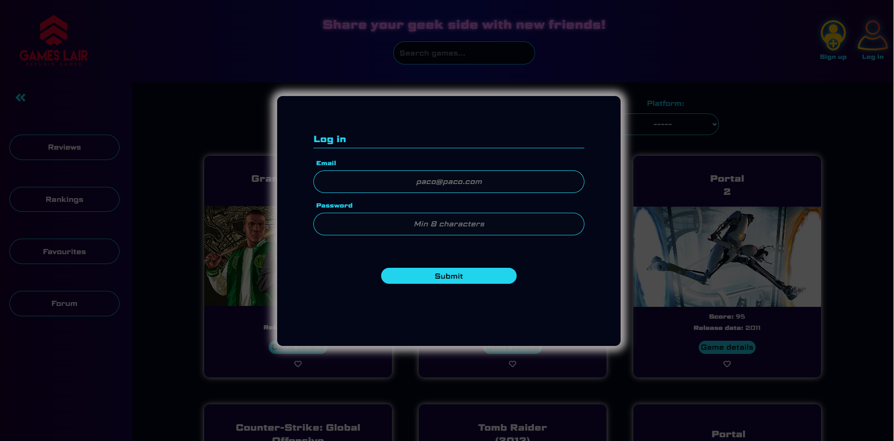
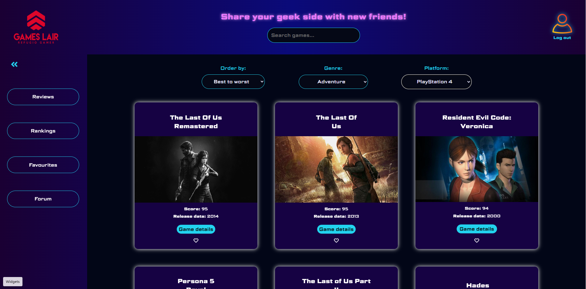
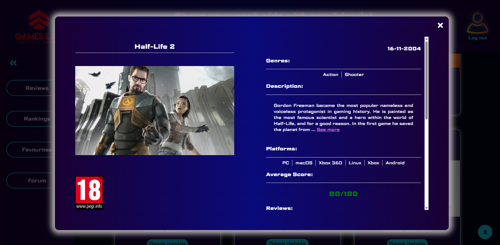
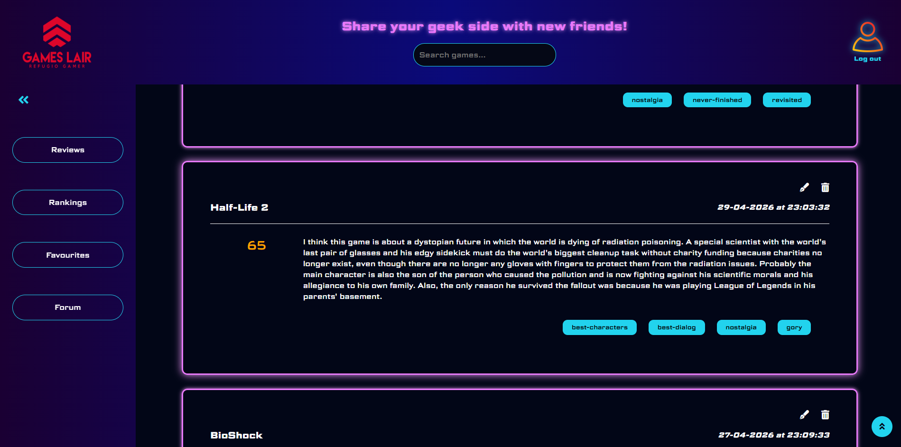
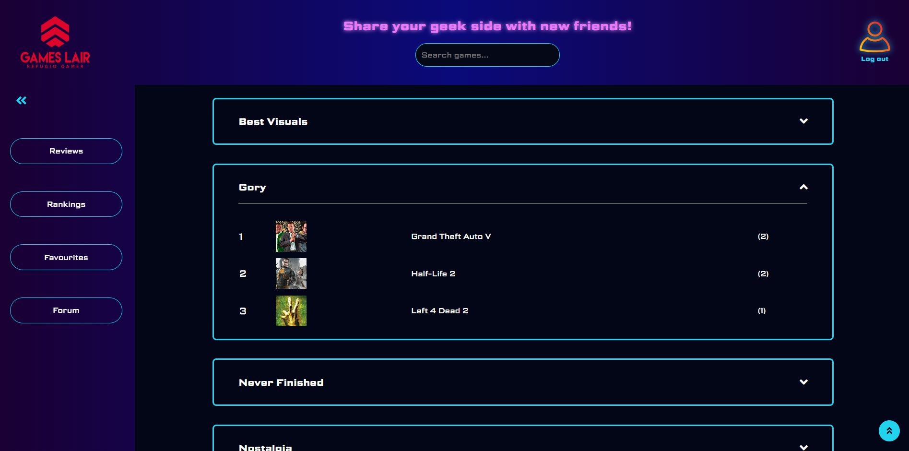
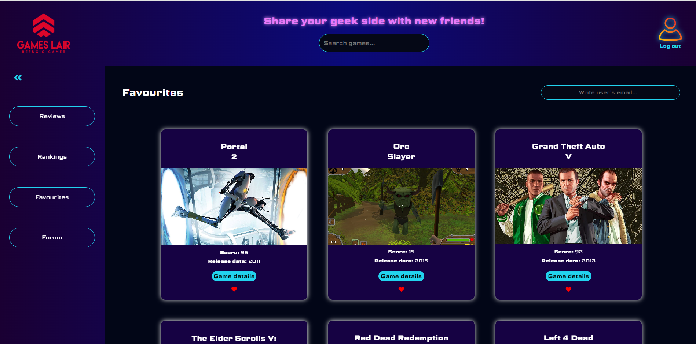
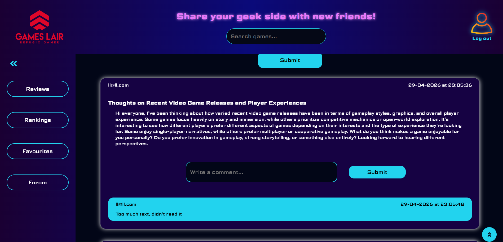

# GAMESLAIR

## INTRODUCCIÓN

Este proyecto es una página de videojuegos, donde podemos realizar nuestras propias reviews, buscar juegos, agregar favoritos, ver rankings, participar en foros e interactuar con otros usuarios. Con esta página he querido crear un espacio especializado en un sector que me apasiona, donde otras personas puedan también conocer, clasificar y encontrar juegos y recomendaciones de otros usuarios.

## INTERFAZ DEL USUARIO

### User login

### Games homepage

### Game details

### User reviews

### Rankings

### Favourites

### Forum

## EMPEZANDO

Estos son los procesos necesarios para hacer funcionar el proyecto.

### API keys

Debemos de entrar en [RAWG.io](https://rawg.io/apidocs) y pulsar en Get API Key. Una vez la obtenemos, en el `.env` le asignamos
el valor a su variable correspondiente `API_KEY`.

### Archivo .env

El usuario debe de crear un archivo .env donde deberá de crear las variables de esta manera:

- `API_KEY` El código de la API utilizada (RAWG.io)
- `PORT` Puerto donde correrá el servidor
- `PASSWORD` Contraseña de la base de datos
- `SECRET` Generado para asegurar el auth (autorización del usuario)

### Inicializando base de datos

A través de XAMPP, pulsando "Start" en MySQL. El schema de las tablas creadas está en la carpeta `server`, con el nombre `schema.sql`.

### Inicializando servidor

Tenemos que navegar a la carpeta `server` a través de la terminal. Una vez dentro, lo inicializamos con `node server.js`.

### Inicializando cliente

Navegamos a la carpeta `client` con la terminal, e inicializamos con `npm run dev`.

## TECNOLOGÍAS USADAS

### Frontend

Se ha utilizado React como librería, el lenguaje JavaScript como lenguaje de programación principal y HTML y CSS para la estructura y estilo de la página.

### Backend

Se ha utilizado `Node.js` con `Express`.

### Auth

Se utilizó JWT (JSON web tokens) y bcrypt para un login más seguro.

### API

RAWG.io, API dedicada a videojuegos. Aporta numerosos datos como imagen del juego, fecha de lanzamiento, nota de metacritic...

### Base de datos

La BBDD usada ha sido MariaDB.

## SEGUIMIENTO DEL PROYECTO

1. Se creó la página principal, el header y la barra de búsqueda.
2. Se crearon todas las conexiones con la API.
3. Se hizo el CSS para la página principal.
4. Implementación de los filtros para buscar resultados más específicos.
5. Se creó la funcionalidad para `Favourites`, así como su correspondiente tabla en la BBDD.
6. Funcionalidad en el backend para la autentificación de los usuarios, y creación de estos en la BBDD.
7. Creación de `Forum` e implementación de las rutas en el frontend, en `Sidebar`.
8. Creación de `Reviews` y todas sus funcionalidades.
9. Creación de `Rankings` a través de los cálculos de las etiquetas elegidas por los usuarios en sus reviews.
10. Mejoras: Mejor organización del código (DRY, separación de intereses), pequeños problemas de interfaz, etc.

## POSIBLES MEJORAS DEL PROYECTO

- Creación de funciones y rutas UPDATE/DELETE para forum y sus comentarios, de forma que los usuarios puedan borrar solo sus propios comentarios o posts.

- Dos Rankings más basados en Mejores juegos y Peores juegos, basándose en las notas medias de los usuarios de la página.

- Un mensaje que muestre `Are you sure?` antes de borrar una página, para confirmar si realmente queremos hacerlo.

- 3 resultados por línea, para que sea número primo y siempre se vean 3 juegos al final antes del botón `See more...`. Puede ser arreglado utilizando `display:grid ;` en CSS.

- Feature para poder determinar un rango de dificultad en el juego.

- Opción para poder reportar usuarios que han cometido alguna irregularidad grave, así como sus tablas.

- En `Filters` una opción para poder quitar las opciones elegidas (pulsando `Choose an option...` o `----` vuelve, pero es menos intuitivo).

- Utilizar la IA para recomendar videojuegos en relación a los favoritos/notas más altas otorgadas, utilizando alguna API como la de OpenAI.

- Mejorar la seguridad creando un middleware que verifique las credenciales del usuario en el lado del servidor.

## PROBLEMA ENCONTRADO

Algunas veces la API no muestra datos correctos (como fechas muy en el futuro, o faltan imágenes, puntuaciones...). Se ha tratado de solucionar de la mejor manera posible añadiendo N/A, una imagen de cabecera en caso de que no haya por defecto, pero

## REFERENCIAS

[TextareaAutosize](https://www.youtube.com/watch?v=vOftV4_roOQ&t=104s)
